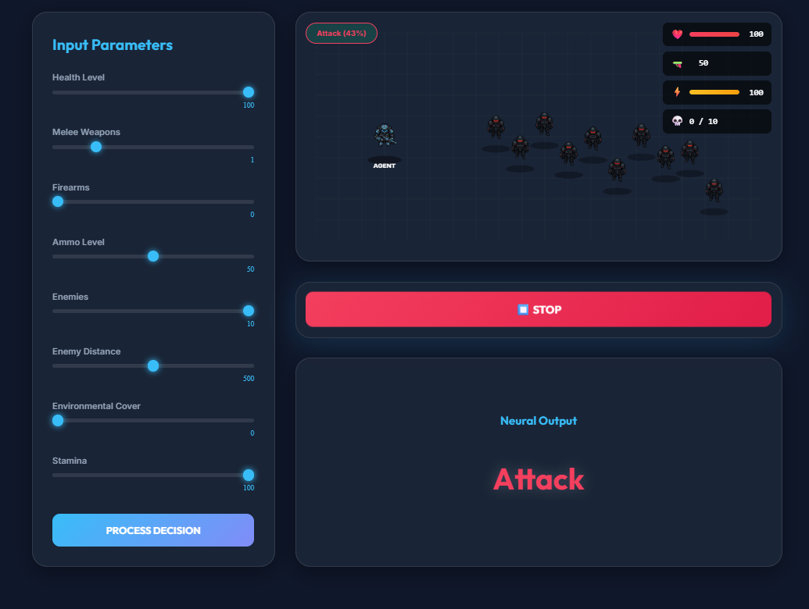

# AI Tactical Decision Agent

A modern, real-time tactical AI decision system built with Vanilla JS and Neural Networks. The agent analyzes combat scenarios with 8 input factors (Health, Ammo, Enemies, Distance, etc.) and executes tactical behaviors (Attack, Retreat, Evade, Hide) with fluid animations.



## ✨ Key Features

### 🧠 Advanced AI Logic
- **Neural Network:** 8-input, 8-hidden, 4-output architecture processing tactical data in real-time.
- **Dynamic Decision Making:** Instantly reacts to slider inputs and battle conditions.
- **Confidence Output:** Displays decision confidence percentage.

### ⚔️ Combat System
- **Ranged Combat:** Ballistic trajectories, recoil, and ammo management.
- **Melee Combat:**
  - Automatic fallback when out of ammo or at close range.
  - **Lunge Mechanic:** Agent dashes forward to strike with distinct slash visuals.
  - **Damage Scaling:** High damage based on Melee Level.
- **Tactical Retreat:** Smooth backward movement with dust particle effects.

### 🎨 Visuals & Immersion
- **Particle Engine:** Custom engine for blood, sparks, muzzle flashes, and dust.
- **Animations:** Idle breathing, recoil, death sequences, and smooth movement interpolations.
- **UI Design:** Glassmorphism interface with interactive sliders and live HUD.

### 🌍 Localization
- **Multi-Language Support:** Instant toggle between **English (🇺🇸)** and **Armenian (🇦🇲)**.
- **Native Typography:** Uses `Noto Sans Armenian` for authentic text rendering.

## 🛠️ Tech Stack
- **Core:** Vanilla JavaScript (ES6+)
- **Build Tool:** Vite
- **Styling:** CSS3 (Variables, Flexbox/Grid, Glassmorphism)
- **Assets:** Custom pixel art sprites

## 🚀 Getting Started

1.  **Install Dependencies:**
    ```bash
    npm install
    ```

2.  **Run Development Server:**
    ```bash
    npm run dev
    ```

3.  **Build for Production:**
    ```bash
    npm run build
    ```

## 🎮 How to Play
1.  Use the **Input Parameters** sliders to set the scenario (e.g., High Enemies, Low Ammo).
2.  Watch the **Neural Output** change in real-time or click **Process Decision**.
3.  Click **⚔️ Start Battle** to watch the simulation.
4.  Switch Language with the **🇦🇲/🇺🇸** button in the header.

## 📄 License
MIT License - 2026 AI Tactical Research Project
